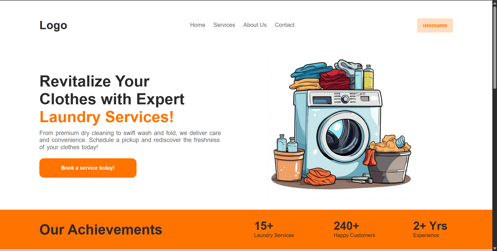
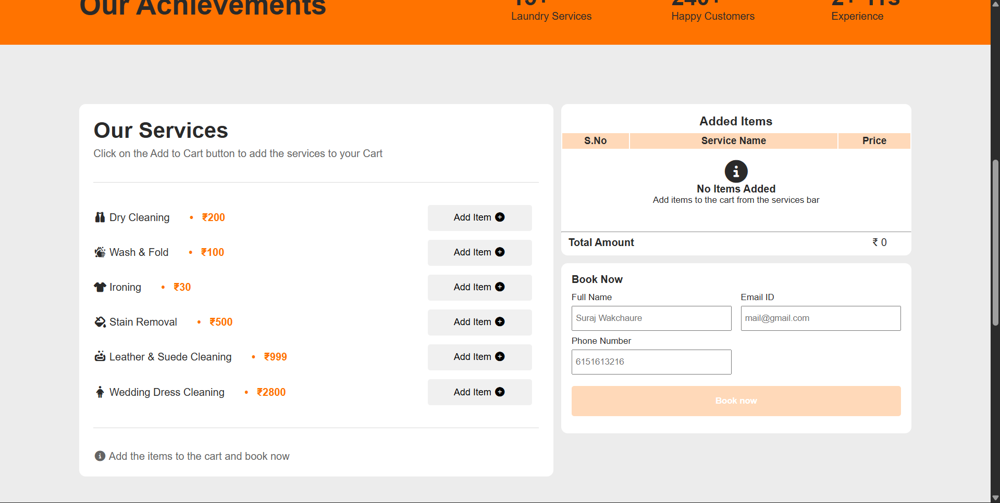

🧺 Laundry Service Booking Website

A responsive and user-friendly laundry service booking web application built using HTML, CSS, and JavaScript.  
This project allows users to book laundry services online and receive booking confirmation via EmailJS integration.

🚀 Features

- 📱 Fully Responsive Design (Mobile, Tablet, Desktop)
- 📝 Online Laundry Booking Form
- ✅ Client-Side Form Validation
- 📧 Real-Time Email Confirmation using EmailJS
- 🎨 Clean and Modern UI Design
- 📂 Structured Project Architecture (HTML, CSS, JS separated)

🛠️ Technologies Used

- HTML5
- CSS3 (Media Queries for responsiveness)
- JavaScript (DOM Manipulation & Validation)
- EmailJS (Email API Integration)

📸 Screenshots

🎯 Purpose of the Project

This project was developed to strengthen frontend development skills, including:

- Responsive web design
- JavaScript-based interactivity
- Third-party API integration
- Clean and maintainable project structure

💡Future Improvements

- Backend integration (Node.js / Express)
- Payment gateway integration
- Admin dashboard for booking management
- Database connectivity (MongoDB/MySQL)

👨‍💻 Author

**Suraj Wakchaure**  
BCA Student | Aspiring Software Developer  
[LinkedIn](https://linkedin.com/in/suraj-wakchaure)  
[GitHub](https://github.com/Suraj-Wakchaure)

⭐ If you like this project, feel free to star the repository!
